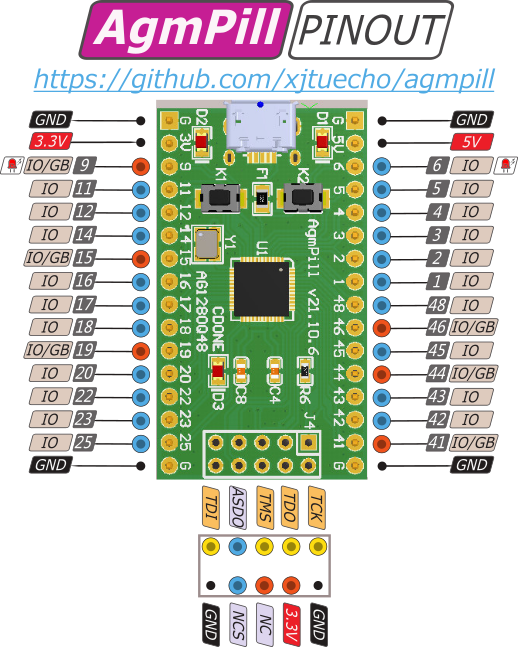
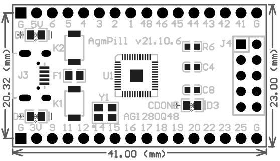
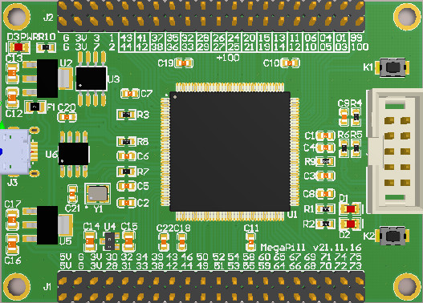
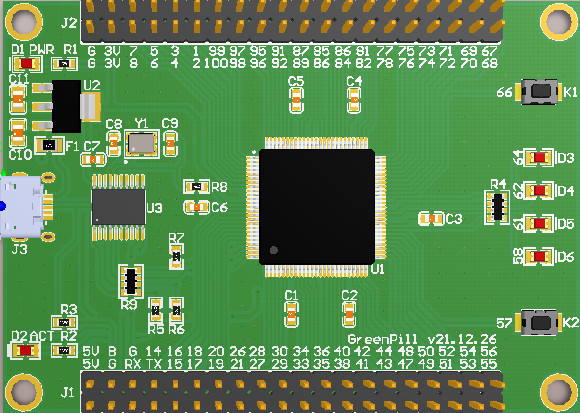

# AgmPill

AgmPill is a low cost FPGA/CPLD dev-board based on AG1280Q48.

AG1280 family provides low cost, ultra-low power CPLDs, with density is 1280 Look-Up Tables(LUTs).
The devices feature Embedded Block Memory (EBR), Distributed RAM, and Phase Locked Loops (PLLs).
The devices are designed for ultra low power and cost while providing programmable solutions for a wide
range of applications, especially in consumer and mobile device products.

## AgmPill Specification

- dimension: 41x23mm.
- 2x16 2.54mm PIN header, 20.32mm(800mil), 26 user IO.
- 2x5 PIN standard USB-Blaster port.
- 24MHz dedicated clock input on PIN_13.
- 1280 LUTs.
- 10 Kbits Distributed RAM.
- 68 Kbits EBR SRAM.
- 1xPLL
- EDA Tool:Quartus and Supra.

## AgmPill Resource

- [AgmPill Schematic](./sch/AgmPill_v21.10.6_SCH.pdf)
- [AG1280Q48 Datasheet](./doc/AG1280/AG1280Q48_V1.0.PDF)
- [AG1280Q48 PINOUT](./doc/AG1280/AG1280Q48_PINOUT.xls)
- [AG1280Q48 MANUAL](./doc/AG1280/MANUAL_AG1280.pdf)
- [A Blink Demo](./hdl/Blink_AG1280)
- [Supra and Documents(Fetch Code: q59e)](http://pan.baidu.com/s/1eQxc6XG)
- [FAQ Document](./doc/AgmPillFAQ.md)
- [Purchase Link](https://item.taobao.com/item.htm?spm=a1z10.1-c.w4023-23472711792.7.7a435ad5EnKqe1&id=668471065760)

## AgmPill PINOUT

# MegaPill

If AgmPill can't satisfy your application, in others words, you need more LEs or IOs, you can try MegaPill, which is based on AG10KL144.

## MegaPill Specification

- dimension: 70x50mm.
- 2x40 2.54mm PIN header.
- Builtin MicroUSB and USB-TTL serial port.
- 2x5 PIN standard USB-Blaster port.
- 24MHz dedicated clock input on PIN_25.
- 10k LEs.
- 414 Kbits EBR SRAM.
- 2xPLL
- EDA Tool:Quartus and Supra.

## MegaPill Resource

- [MegaPill Schematic](./sch/MegaPill_v21.11.16.pdf)
- [AG10KL144 Datasheet](./doc/AG10K/AGM_FPGA_AG6K_AG10K_Rev1.1.PDF)
- [AG10KL144 PINOUT](./doc/AG10K/AG10K_FBGA256_LQFP144_Pinout_Release.xls)
- [AG10KL144 MANUAL](./doc/AG10K/AG10K_guide.pdf)
- [A Blink Demo](./hdl/Blink_AG10KL144)
- [Supra Manual](./doc/MANUAL_Supra_6.2.pdf)

## MegaPill PINOUT

# GreenPill

If you are familiar with Altera Max II CPLD, you can try GreenPill, which is based on AG256SL100. AG256SL100 is pin2pin compatible with EPM240T100.
Furthermore, GreenPill has a built-in USB-Blaster, you can download bitstream to the chip with a MicroUSB cable.

## GreenPill Specification

- dimension: 70x50mm.
- 2x40 2.54mm PIN header.
- Builtin USB-Blaster.
- 256 LUTs.
- 256 Kbits UFM.
- EDA Tool:Quartus and Supra.

## GreenPill Resource

- [GreenPill Schematic](./sch/GreenPill_v21.12.26.pdf)
- [AG256SL100 Datasheet](./doc/AGCPLD/AG_CPLD_Rev1_1.PDF)
- [A Blink Demo](./hdl/Blink_AG256SL100)

## GreenPill PINOUT

