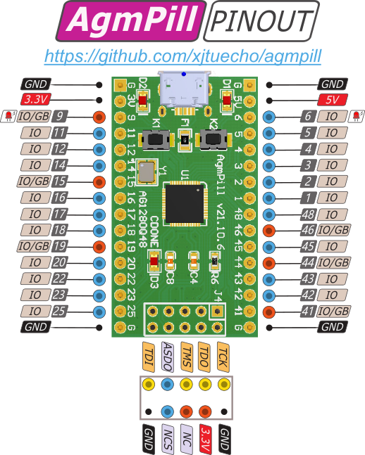

# AgmPill

AgmPill is a low cost FPGA/CPLD dev-board based on AG1280Q48.

AG1280 family provides low cost, ultra-low power CPLDs, with density is 1280 Look-Up Tables(LUTs). 
The devices feature Embedded Block Memory (EBR), Distributed RAM, and Phase Locked Loops (PLLs). 
The devices are designed for ultra low power and cost while providing programmable solutions for a wide 
range of applications, especially in consumer and mobile device products. 

## The specification of AgmPill

- dimension: 41x23mm.
- 2x16 2.54mm PIN header, 26 user IO.
- 2x5 PIN standard Altera USB-Blaster port.
- 24MHz dedicated clock input on PIN_13.
- 1280 LUTs.
- 10 Kbits Distributed RAM.
- 68 Kbits EBR SRAM.
- 1xPLL
- EDA Tool:Quartus and Supra.

## The pinout of AgmPill

## Resource

- [Schematic](./doc/AgmPill_v21.10.6.pdf) of AgmPill.
- [Datasheet](./doc/AG1280Q48_V1.0.PDF) of AG1280Q48.
- [PINOUT](./doc/AG1280Q48_PINOUT.xls) of AG1280Q48.
- [Chinese MANUAL](./doc/MANUAL_AG1280.pdf) of AG1280Q48.
